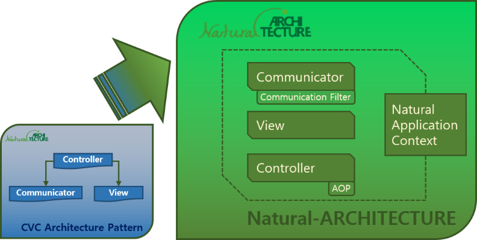

# Natural-JS Architecture Guide

Natural-JS is designed based on the CVC (Controller-View-Communicator) architecture pattern. This document explains the core elements of the Natural-JS architecture.

## Table of Contents

- [Controller](#controller)
  - Overview
  - Page ID (pageid) Management
  - Obtaining Controller Instance
  - Constructor
  - Controller Object Constants
  - Controller Object Methods
  - Examples
- [AOP](#aop)
  - Overview
  - pointcuts Object
  - advisors Object
  - Examples
- [Communicator](#communicator)
  - Overview
  - Constructor
  - Methods
  - Examples
- [Communicator.request](#communicatorrequest)
  - Overview
  - Default Options
  - Methods
  - Examples
- [Communication Filter](#communication-filter)
  - Overview
  - Filter Object Default Options and Methods
  - Examples
- [Context](#context)
  - Overview
  - Methods
  - Examples

## Controller

### Overview

Controller (N.cont) is the class that implements the Controller layer of the CVC Architecture Pattern. N.cont executes the init function of the Controller object and returns the Controller object. The Controller object controls the elements of the View and the data retrieved by the Communicator.



N.cont should be declared immediately below the View area of the page as follows:

```html
<article class="view">
    <p>View Area</p>
</article>

<script type="text/javascript">
    N(".view").cont({ // Controller object
        init : function(view, request) {
            // Initialization code
        }
    });
</script>
```

When a page with this structure is loaded via N.popup, N.tab component, or N.comm library, the init function of the Controller object is called after the page is loaded.

> **Note**: For a Natural-ARCHITECTURE-based page to work properly, it must be loaded via the N.comm library or N.popup, N.tab components.

> **Important**: When selecting elements on the page, always use find from the view or specify the view as the context argument (second argument) of the jQuery function. Otherwise, you may select unintended elements from other block pages, causing unpredictable errors.

### Page ID (pageid) Management

When N.cont is executed, a `data-pageid` attribute is automatically created for the element specified by the selector. For example, executing `N(".view").cont()` will create a `data-pageid="view"` attribute on the `.view` element.

The following characters are removed when generating the pageid:
- `.` (dot)
- `#` (hash)
- `[` (left bracket)
- `]` (right bracket)
- `'` (single quote)
- `"` (double quote)
- `:` (colon)
- `(` (left parenthesis)
- `)` (right parenthesis)
- `>` (greater-than)
- space
- `-` (hyphen)

For example, `N("page.view-01").cont()` will generate the pageid as "pageview01" by removing dots and hyphens. It is recommended to define page identifiers without these characters.

### Obtaining Controller Instance

To control a specific page such as a block page or tab content, you can obtain the Controller object as follows:

```javascript
var page01Cont = N("#page01").instance("cont");
page01Cont.gridInst.bind([]);
```

### Constructor

- **N.cont**: Initializes and returns a Controller object. Registers and manages the Controller object.

  ```javascript
  var controllerObject = N.cont(N(view), ControllerObject);
  ```

  - **view**: jQuery object specifying the view area.
  - **ControllerObject**: Defines the Controller object. If an init function is created in the Controller object, it is executed after the view is loaded. The view element and Communicator.request object are passed as arguments to the init function.

  ```javascript
  N(".view").cont({
      init : function(view, request) {
      }
  });
  ```

  When selecting elements with jQuery, $, or N in the Controller object, always specify the context argument as view:

  ```javascript
  N(".view").cont({
      init : function(view, request) {
          N("selector", view);
      }
  });
  ```

- **N().cont**: Initializes the Controller object as a jQuery plugin.

  ```javascript
  var controllerObject = N(view).cont(ControllerObject);
  ```

  The initialization method is different, but the Controller object initialized with `new N.cont` and the one initialized with `N().cont` are the same. The first argument of the N() function is set as the first argument of the new N.cont constructor.

### Controller Object Constants

The Controller object defines the following constants:

- **view**: jQuery object for the view element. Same as the first argument of the init function.
- **request**: Communicator.request instance. Same as the second argument of the init function.
- **caller**: N.popup or N.tab instance if the page was loaded by these components.
- **opener**: Controller object of the parent page if the page was loaded by N.popup or N.tab. The opener property is set by specifying the Controller object as the opener option when creating the N.popup or N.tab instance.

### Controller Object Methods

- **init**: User-defined function called after the view is loaded and the Controller object is initialized.

  ```javascript
  N(".view").cont({
      init : function(view, request) {
      }
  });
  ```

  - **view**: jQuery object for the view element.
  - **request**: Communicator.request object for the page loaded by Communicator (N.comm).

### Examples

1. Defining View and Controller:

   ```html
   <!-- View -->
   <article class="view">
       <p>View</p>
   </article>

   <!-- Controller -->
   <script type="text/javascript">
       N(".view").cont({
           init(view, request) {
               N("p", view).css("padding", "10px");
           }
       });
   </script>
   ```

2. Referencing the Controller object in the scope of all functions implemented in the Controller object:

   ```html
   <article class="view">
       <p>View</p>
   </article>

   <script type="text/javascript">
   (() => {
       const cont = N(".view").cont({
           init(view, request) {
               this.fn();
           },
           fn() {
              N("p", cont.view).css("padding", "10px");
           }
       });
   })();
   </script>
   ```

## AOP

### Overview

Natural-ARCHITECTURE supports AOP (Aspect-Oriented Programming) for Controller objects.

AOP declarations can be defined in the `N.context.attr("architecture").cont.pointcuts` and `N.context.attr("architecture").cont.advisors` properties in Config (natural.config.js). You can specify the target Controller object with a pointcut and execute common logic by specifying adviceType as before, after, around, or error.

Using AOP in Natural-JS allows you to standardize or template repetitive logic in UI development, greatly improving productivity.

> Note: If you instantiate Controller object functions using the new operator, errors may occur. In such cases, exclude those functions from the pointcut.

### pointcuts Object

Define in the `N.context.attr("architecture").cont.pointcuts` property of natural.config.js.

- **pointcut name**: Defines a user pointcut for use in advisors. Must be a function with parameters: param (regex string or RegExp object), cont (Controller object), fnChain (function chain string). The function result (boolean) determines whether the advice is applied.

  Example:

  ```javascript
  "pointcuts" : {
      "regexp" : {
          "fn" : function(param, cont, fnChain){
              var regexp = param instanceof RegExp ? param : new RegExp(param);
              return regexp.test(fnChain);
          }
      },
      "errorPointcut" : {
          "fn" : function(param, cont, fnChain){
              // Always allow
              return true;
          }
      }
  }
  ```

A built-in regexp pointcut is provided, so you usually do not need to define a custom pointcut unless necessary.

### advisors Object

Define in the `N.context.attr("architecture").cont.advisors` property of natural.config.js.

- **pointcut**: Specifies the pointcut to which the advisor applies. Can be a string or object. If a string, the built-in regexp pointcut is used by default. You can also specify a jQuery selector before the regex, separated by a colon, to apply only to selected pages.
- **adviceType**: Sets when the advisor is executed. `before`, `after`, `around`, or `error`.
- **fn**: Defines the advisor function. Arguments vary by adviceType:
  - **before**: (cont, fnChain, args)
  - **after**: (cont, fnChain, args, result)
  - **around**: (cont, fnChain, args, joinPoint)
  - **error**: (cont, fnChain, args, result, e)

  Example (before):

  ```javascript
  "advisors" : [{
      "pointcut" : "^init$",
      "adviceType" : "before",
      "fn" : function(cont, fnChain, args) {
          // Executed before the init function is called after the page loads.
      }
  }]
  ```

  Example (after):

  ```javascript
  "advisors" : [{
      "pointcut" : "^init$",
      "adviceType" : "after",
      "fn" : function(cont, fnChain, args, result) {
          // Executed after the init function is called after the page loads.
      }
  }]
  ```

  Example (around):

  ```javascript
  "advisors" : [{
      "pointcut" : "^init$",
      "adviceType" : "around",
      "fn" : function(cont, fnChain, args, joinPoint) {
          // before
          var result = joinPoint.proceed();
          // after
      }
  }]
  ```

  Example (error):

  ```javascript
  "advisors" : [{
      "pointcut" : {
          "type" : "errorPointcut",
          "param" : ""
      },
      "adviceType" : "error",
      "fn" : function(cont, fnChain, args, result, e) {
          // Executed whenever an error occurs in a function defined in the Controller object.
      }
  }]
  ```

### Examples

#### 1. Declaring AOP

AOP settings are configured in the `N.context.attr("architecture").cont` property of natural.config.js.

```javascript
N.context.attr("architecture", {
    ...
    "cont" : {
        "pointcuts" : {
            "regexp" : {
                "fn" : function(param, cont, fnChain){
                    var regexp = param instanceof RegExp ? param : new RegExp(param);
                    return regexp.test(fnChain);
                }
            },
            "errorPointcut" : {
                "fn" : function(param, cont, fnChain){
                    // Always allow
                    return true;
                }
            }
        },
        "advisors" : [{
            "pointcut" : "^before.*",
            "adviceType" : "before",
            "fn" : function(cont, fnChain, args){
                console.log("call me before %s", fnChain);
            }
        }, {
            "pointcut" : "^after.*",
            "adviceType" : "after",
            "fn" : function(cont, fnChain, args, result){
                console.log("call me after %s", fnChain);
                console.log("result", result);
            }
        }, {
            "pointcut" : "^around.*",
            "adviceType" : "around",
            "fn" : function(cont, fnChain, args, joinPoint){
                console.log("call me around %s", fnChain);
                var result = joinPoint.proceed();
                console.log("result ", result);
                return result;
            }
        }, {
            "pointcut" : {
                "type" : "errorPointcut",
                "param" : ""
            },
            "adviceType" : "error",
            "fn" : function(cont, fnChain, args, result, e) {
                console.log("call me error %s", fnChain);
            }
        }]
    },
    ...
}
```

#### 2. Load common code for all pages, bind to elements with N.select, then delay Controller object's init execution

```javascript
N.context.attr("architecture", {
    ...
    "cont" : {
        "advisors" : [{
            "pointcut" : "^init$",
            "adviceType" : "around",
            "fn" : function(cont, fnChain, args, joinPoint){
                // 1. Get common code data
                N.comm("getCommCodeList.json").submit(function(data) {
                    // 2. Bind common code to select elements with N.select
                    N(data).select({
                        context : N("#select", cont.view)
                    }).bind()

                    // 3. Execute init function
                    joinPoint.proceed();
                });
            }
        }]
    },
    ...
}
```

#### 3. After automatically initializing button, form, grid, and list components on the loaded page, execute the init function

```javascript
N.context.attr("architecture", {
    ...
    "cont" : {
        "advisors" : [{
            "pointcut" : "^init$",
            "adviceType" : "around",
            "fn" : function(cont, fnChain, args, joinPoint){
                // 1. Initialize button components
                N(".button").button();

                // 2. Initialize form components
                N(".form", cont.view).each(function() {
                    N([]).form(this);
                })

                // 3. Initialize list components
                N(".list", cont.view).each(function() {
                    N([]).list(this);
                })

                // 4. Initialize grid components
                N(".grid", cont.view).each(function() {
                    N([]).grid(this);
                })

                // 5. Execute init function
                joinPoint.proceed();

                // 6. Afterwards, retrieve each component instance from the context as needed
                var grid01 = N("#grid01", cont.view).instance("grid");
                grid01.bind([]);
            }
        }]
    },
    ...
}
```

## Communicator

### Overview

Communicator (N.comm) is the class that implements the Communicator layer of the CVC Architecture Pattern. N.comm is a library that supports Ajax communication with the server, such as requesting content or data and passing parameters.

When calling the N.comm function or the N().comm method, the options (opts) set are applied as options for the Communicator.request object. For details on Communicator.request object options, see the Default Options section of [Communicator.request](#communicatorrequest).

### Constructor

- **N.comm**: Creates an N.comm instance. You can use the N.comm object directly without the new operator. When the N.comm function is called or an instance is created with the new operator, a Communicator.request object instance is created and bound to the request property of the object.

  ```javascript
  var comm = N.comm(param|element|url, opts|url);
  ```

  - **param|element|url**: If the first argument is a jQuery object containing an object or array[object], and the second argument (url) is a server URL that returns JSON data, the object is converted to a string and sent to the server as GET or POST parameters. This value is set as the data property of the Communicator.request default options.
  - **opts|url**: If an object is set, it is applied as the default options for the Communicator.request object. If a string is set, it is applied as the url option of the Communicator.request object.

  Example:

  ```javascript
  N.comm({ "param" : "value" }, "data.json").submit(function(data) {});
  ```

  If the type (HTTP METHOD) option is GET and the data property (param) is an object or array[object], the parameter string is URL-encoded and set as the value of the "q" parameter.

  Example:

  ```
  data.json?q=%5B%7B%22param%22%3A%22value%22%7D%5D
  // q=[{"param":"value"}]
  ```

  When loading an HTML page:

  ```javascript
  N.comm(N("#contents"), "page.html").submit();
  ```

  If the first argument is a jQuery object containing an HTML element and the second argument (url) is a server URL that returns an HTML page, the loaded page is inserted into the specified element.

  To pass parameters to a page:

  ```javascript
  N.comm(N("#contents"), "page.html").request.attr("pageParam", "value").submit();
  ```

- **N().comm**: Creates an N.comm object instance as a jQuery plugin.

  ```javascript
  var comm = N(param|element).comm(opts|url);
  ```

  The method of creating the object instance is different, but the instance created with `new N.comm()` and the one created with `N().comm` are the same. The first argument of the N() function is set as the first argument of the new N.comm constructor.

### Methods

- **submit**: Sends a request to the server and registers a callback function to be executed when a successful server response is received. If no callback is provided, a Promise-compatible xhr object is returned, allowing use of async/await syntax.

  Example:

  ```javascript
  // JSON Data
  const fn1 = async () => {
      const data = await N.comm("data.json").submit();
  };

  // Catch exception
  const fn2 = () => N.comm("data.json").submit().then((data) => {
      console.log(data);
  }).catch((e) => {
      console.error(e);
  });

  // HTML page
  const fn3 = async () => {
      const data = await N("#page-container").comm("page.html").submit();
      console.log(data); // HTML Text
  };
  ```

  - **callback**: User-defined function to handle the server response. If an HTML page is requested, the loaded page's Controller object is returned as the argument to the callback. For other requests, the data object and Communicator.request object are returned.

  Example:

  ```javascript
  // JSON Data
  N.comm("data.json").submit(function(data, request) {
      N.log(data, request);
  });

  // HTML page
  N("#page-container").comm("page.html").submit(function(cont) {
      N.log(cont); // cont : Controller object
  });
  ```

- **error**: Registers a callback function to be executed when an error response is received from the server or an error occurs in the submit method's callback function. Multiple error handlers can be registered by calling error multiple times.

  - **callback**: User-defined function to handle errors. The callback's `this` is the created N.comm instance, and the following arguments are returned:
    - xhr: jQuery XMLHTTPRequest
    - textStatus: "success" (if error in submit callback) or "error" (if server error)
    - e: ErrorThrown
    - request: Communicator.request
    - callback: The callback function specified as an argument to the submit method if textStatus is "success".

  Example:

  ```javascript
  N.comm("data.json").error(function(xhr, textStatus, e, request, callback) {
      // First error handler
  }).error(function(xhr, textStatus, e, request, callback) {
      // Second error handler
  }).submit(function(data, request) {
      var col01;
      col01.length; // Triggers undefined error
  });
  ```

### Examples

1. Retrieve data from the server

   ```javascript
   // callback
   N.comm("data.json").submit(function(data) {
       N.log(data);
   });

   // async / await
   const fn = async () => {
       const data = await N.comm("data.json").submit();
       console.log(data);
   };
   fn();
   ```

2. Send parameters to the server and retrieve result data

   ```javascript
   N({ "param1": 1, "param2": "Mark" }).comm("data.json").submit(function(data) {
       N.log(data);
   });
   ```

3. Insert an HTML page into a specified element

   ```html
   <article id="view-0001"></article>

   <script type="text/javascript">
       // Loads "page.html" into the "#view-0001" element and executes the init method of the Controller object of the loaded page.
       N("#view-0001").comm("page.html").submit(function(cont) {
           // cont : Controller object of the loaded page
           // Executed after the page is inserted
       });

       const fn = async () => {
           const data = await N("#view-0001").comm("page.html").submit();
           console.log(data); // HTML Text
           const cont = N("#view-0001 .view_context__").instance("cont");
           console.log(cont); // Controller object of the loaded page
       };
       fn();
   </script>
   ```

## Communicator.request

### Overview (Communicator.request)

Communicator.request is a request information object created each time N.comm is initialized. The options of the N.comm() function are stored in the Communicator.request.options object and are passed as headers or parameters for the server request.

When requesting a page file, the request object is passed as the second argument to the Controller object's init function or as a member variable (this.request) of the Controller object. You can use the request object to check request information or receive page parameters.

### Default Options

- **append** (boolean, default: false): If true, the loaded page is added to the element specified by the target option instead of overwriting it.
- **urlSync** (boolean, default: true): If false, the response is not blocked even if location.href at the time of the server request and at the time of the server response are different.
- **dataIsArray** (boolean, default: false): If true, allows the parameter object specified as an argument to the N() function to be an array type. See documentation for details on array handling.
- **target** (jQuery object, default: null): Specifies the element where HTML content will be inserted.
- **contentType** (string, default: application/json; charset=utf-8): Specifies the contentType for the server request. Same as the jQuery.ajax option.
- **cache** (boolean, default: false): If true, the requested page is cached by the browser. Same as the jQuery.ajax option.
- **type** (string, default: POST): HTTP method to use for the request (e.g., "POST", "GET", "PUT"). Same as the jQuery.ajax option.
- **data** (json object array or json object, default: null): Data to be sent to the server. If not a string, it is converted to a string. Same as the jQuery.ajax option.
- **dataType** (string, default: "json"): Type of server response data (xml, json, script, or html). Same as the jQuery.ajax option.
- **crossDomain** (boolean, default: false): Set to true to force crossDomain requests (e.g., JSONP) on the same domain. Same as the jQuery.ajax option.

> N.comm uses the jQuery.ajax module to handle Ajax requests. All options except beforeSend, success, error, and complete are applied as in jQuery.ajax.

### Methods (Communicator.request)

- **attr**: Sets or gets data to be passed to the page being loaded, or retrieves data passed to the page. If two arguments are provided, it acts as a setter; if one argument is provided, it acts as a getter.

  - **name** (string): Name of the data.
  - **obj** (any): Value of the data.

### Examples (Communicator.request)

1. Passing data (page parameters) to the page being loaded:

   ```javascript
   // 1.1. Before calling the submit method, execute (Communicator instance).request.attr("name", object).
   N(".view").cont({
       init : function(view, request) {
           N("#section").comm("page.html")
               .request.attr("data1", { data : ["1", "2"] })
               .request.attr("data2", ["3", "4"])
                   .submit();
       }
   });

   // 1.2. In the init method of the Controller object of the loaded page, retrieve the data passed with the attr method of the Communicator.request instance.
   N(".view").cont({
       init : function(view, request) {
           var data1 = request.attr("data1"); // { data : ["1", "2"] }
           var data2 = request.attr("data2"); // ["3", "4"]
       }
   });
   ```

## Communication Filter

### Overview

The Communication Filter allows you to execute common logic at every request, response, or error stage when communicating with the server via N.comm.

Filter declarations are defined in the `N.context.attr("architecture").comm.filters` object in Config (natural.config.js). The filter stages are as follows:

- beforeInit: Executed before N.comm is initialized.
- afterInit: Executed after N.comm is initialized.
- beforeSend: Executed before sending a request to the server.
- success: Executed when a successful response is received from the server.
- error: Executed when an error response is received from the server.
- complete: Executed when the server response is complete.

If you use jQuery.ajax instead of N.comm, you cannot use the Communication Filter.

### Filter Object Default Options and Methods

- **order** (number): Sets the execution order of the filter object. Filters with the order property defined are executed first, followed by those without.
- **beforeInit** (function): Executed before N.comm is initialized. The obj argument is the parameter data object or the element where the page will be inserted. If you return an Error object, subsequent filters are not executed.
- **afterInit** (function): Executed after N.comm is initialized. The request argument is the Communicator.request object. If you return an Error object, subsequent filters are not executed.
- **beforeSend** (function): Executed before sending a request to the server. Arguments: request (Communicator.request), xhr (jQuery XMLHTTPRequest), settings (request info). If you return an Error object, subsequent filters are not executed.
- **success** (function): Executed when a request is successful. Arguments: request, data, textStatus, xhr. If you return an Error object, subsequent filters are not executed. If you return modified data, it is used as the response data for all Communicator submit callbacks.
- **error** (function): Executed when an error occurs. Arguments: request, xhr, textStatus, errorThrown. If you return an Error object, subsequent filters are not executed.
- **complete** (function): Executed when the server response is complete. Arguments: request, xhr, textStatus. If you return an Error object, subsequent filters are not executed.

### Examples

All requests and responses called via N.comm pass through the defined filters, so you can define logic to be applied commonly between server requests and responses. The request argument in filter event handler functions contains useful information about the Ajax request. For details on the request object, see the [Communicator.request](#communicatorrequest) section.

You can declare multiple filters, and the property names of the filter objects in the filters object can be freely specified. Filter settings are defined in the `N.context.attr("architecture").comm.filters` property of natural.config.js.

```javascript
N.context.attr("architecture", {
    "comm" : {
        "filters" : {
            "exFilter1" : {
                order : 1,
                beforeInit : function(obj) {
                },
                afterInit : function(request) {
                },
                beforeSend : function(request, xhr, settings) {
                },
                success : function(request, data, textStatus, xhr) {
                    // If you return modified data, it is used as the response data for all Communicator submit callbacks.
                },
                error : function(request, xhr, textStatus, errorThrown) {
                },
                complete : function(request, xhr, textStatus) {
                }
            },
            "exFilter2" : {
                order : 2,
                beforeInit : function(obj) {
                },
                afterInit : function(request) {
                },
                beforeSend : function(request, xhr, settings) {
                },
                success : function(request, data, textStatus, xhr) {
                },
                error : function(request, xhr, textStatus, errorThrown) {
                },
                complete : function(request, xhr, textStatus) {
                }
            }
        }
    }
});
```

## Context

### Overview (Context)

Context (N.context) is a space that guarantees data persistence within the life cycle of a Natural-JS-based application (from page load until redirect to another URL).

Natural-JS environment settings, framework common messages, etc. are stored in the N.context object.

### Methods (Context)

- **attr**: Sets or gets data to be stored in the Context. If two arguments are provided, it acts as a setter; if one argument is provided, it acts as a getter.
  - **name** (string): Name of the data.
  - **obj** (any): Value of the data.

### Examples (Context)

1. Storing data in Context:

   ```javascript
   N.context.attr("globalInfo", {
       userId : "jeff1942",
       userNm : "Jeff beck"
   });
   ```

2. Retrieving data stored in Context:

   ```javascript
   var globalInfo = N.context.attr("globalInfo");
   ```
