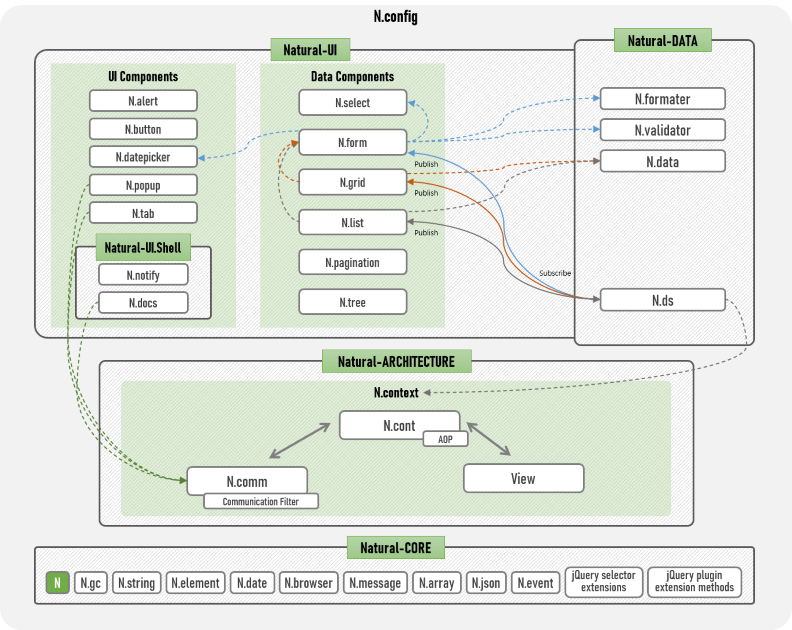
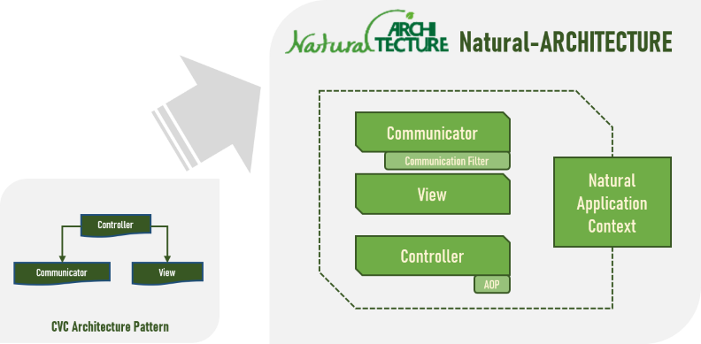
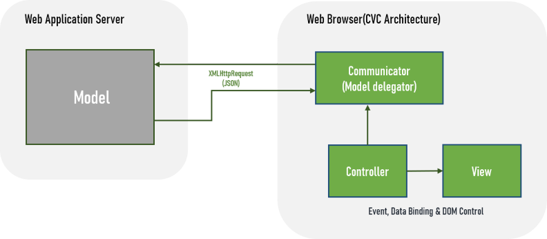
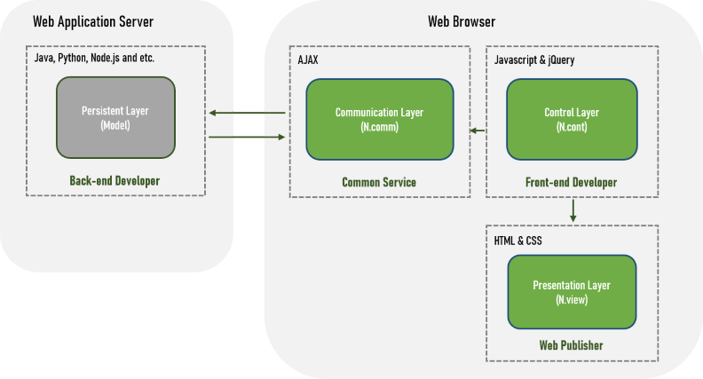
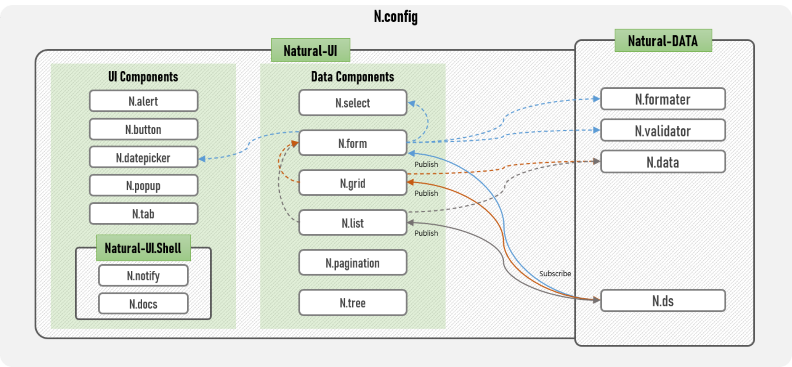

# Natural-JS

Natural-JS is a JavaScript architectural framework designed to enable intuitive, easy, and fast implementation of user interfaces for enterprise web applications.

## Structure

Natural-JS consists of Natural-CORE, Natural-ARCHITECTURE, Natural-DATA, and Natural-UI library packages.
Natural-CORE is a common library package used globally within Natural-JS, and Natural-ARCHITECTURE is a library package that constitutes the architecture of Natural-JS.
Natural-DATA is a library package that supports data synchronization, formatting, validation, and processing, and Natural-UI is a library package that provides HTML-based UI components.

## Natural-CORE

### CORE Utilities - N() & N
N() is the core method of Natural-JS. It returns a collection of matching elements found in the DOM based on the passed arguments or created by passing an HTML string.

N is an object class where Natural-JS's core functions are defined.

[N() and N](html/naturaljs/refr/refr0101.html) provide the following jQuery extension features and utility classes:
* 
* jQuery selector extension: jQuery selector extension that allows selectors to be defined with HTML style or data- attributes
* jQuery plugin extension methods: Natural-JS utility methods created as jQuery plugins
* N: Object class where Natural-JS's core functions are defined
* N.gc: Utility collection class for Natural-JS internal garbage collection
* N.string: Collection class of functions for string control
* N.element: Collection class of functions for HTML element control
* N.date: Collection class of functions for date control
* N.browser: Collection class of functions related to web browser information
* N.message: Collection class of functions for message (multilingual) processing
* N.array: Collection class of functions for array data manipulation
* N.json: Collection class of functions for JSON data manipulation
* N.event: Collection class of functions for event control

### Natural Config - Config(natural.config.js)

[Config(natural.config.js)](html/naturaljs/refr/refr0102.html) is a space for storing Natural-JS operating environment settings, AOP settings, Communication Filter settings, default option values for UI components, etc.

## Natural-ARCHITECTURE

Natural-ARCHITECTURE is a library package that constitutes the architecture of Natural-JS.

### Communicator-View-Controller(CVC) Architecture Pattern

The CVC pattern is an architecture pattern based on the Model-View-Controller (MVC) pattern. As shown in the figure below, it's a client-centered architecture pattern that organizes the client browser area into a Communicator-View-Controller architecture and defines the entire server as the Model area.
Applying the CVC pattern allows client browser implementation technology to break away from server technology and server architecture dependencies, and perfectly separates the design area from the development area, reducing the complexity of development.

### Natural Architecture Framework

Natural Architecture Framework is an architecture framework that implements the CVC Architecture Pattern.

- Natural Architecture Framework clearly distinguishes development business areas, providing a foundation for division of labor among experts in each area.

#### Controller

[Controller(N.cont)](html/naturaljs/refr/refr0201.html) is a class that implements the Controller layer of the CVC Architecture Pattern.
 * Controller object is an object where user-defined functions that control block pages are implemented.
 * N.cont executes the init function of the Controller object and returns the Controller object.
 * Natural-ARCHITECTURE supports AOP (Aspect-Oriented Programming) for Controller objects.

#### View

View does not have a separate implementation, and the HTML element area of the block page is defined as View.

#### Communicator

[Communicator(N.comm)](html/naturaljs/refr/refr0203.html) is a class that implements the communicator layer of the CVC architecture pattern.
 * N.comm is a library that supports Ajax communication with the server, such as requesting content or data from the server or passing parameters.
 * N.comm provides a [Communication Filter](html/naturaljs/refr/refr0205.html) function that can execute common logic at all stages of requesting, responding, or error occurring when communicating with the server.

[Context(N.context)](html/naturaljs/refr/refr0206.html) is a space that guarantees the persistence of data within the Life-Cycle (from when the page is loaded until redirected to another URL) of a Natural-JS-based application.
* Natural-JS environment setting values ([Config(natural.config.js)](html/naturaljs/refr/refr0102.html)), framework common messages, etc. are stored in the N.context object.

## Natural-DATA

Natural-DATA is a library package that supports data synchronization, formatting, validation, and processing.

### DataSync

DataSync is a library that synchronizes data changed by components or libraries in real-time.
* DataSync supports two-way data binding between components.

### Formatter

[Formatter(N.formatter)](html/naturaljs/refr/refr0301.html) is a library that formats the input dataset (json object array) and returns the formatted dataset.

### Validator

[Validator(N.validator)](html/naturaljs/refr/refr0302.html) is a library that checks the validity of the input dataset (json object array) and returns the inspection result dataset.

### Natural-DATA Library

[Natural-DATA Library](html/naturaljs/refr/refr0303.html) provides methods and functions for sorting, filtering, and refining data of json object array type.

## Natural-UI

Natural-UI is a library package that supports HTML-based UI components.

> Grid, List, Form, and other components do not have their own styles. If you define styles for the component's context elements (table, ul/li, etc.) before initializing the component, the component will be created according to the defined styles.

### Alert

[Alert(N.alert)](html/naturaljs/refr/refr0401.html) is a UI component that expresses message dialog boxes like window.alert or window.confirm in the form of layer popups.

### Button

[Button(N.button)](html/naturaljs/refr/refr0402.html) is a UI component that creates buttons using "a, input[type=button], button" elements specified by the context option.

### Datepicker

[Datepicker(N.datepicker)](html/naturaljs/refr/refr0403.html) is a UI component that displays a calendar popup where you can select a date or month to enter in the text input element specified by the context option.

### Popup

[Popup(N.popup)](html/naturaljs/refr/refr0404.html) is a UI component that creates a layer popup from internal elements specified by the context option or a page specified by the url option.

### Tab

[Tab(N.tab)](html/naturaljs/refr/refr0405.html) is a UI component that creates a tab page view by specifying an element consisting of div>ul>li tags with the context option.

### Select

[Select(N.select)](html/naturaljs/refr/refr0406.html) is a UI component that creates selection elements by binding data to select, input[type=checkbox], input[type=radio] elements and extends the functionality of the corresponding controls.

### Form

[Form(N.form)](html/naturaljs/refr/refr0407.html) is a UI component that binds or creates single row data to elements (div, table, or other block elements) specified by the context option.

### List

[List(N.list)](html/naturaljs/refr/refr0408.html) is a UI component that creates a data list in a single column format by specifying a ul>li element with the context option.

### Grid

[Grid(N.grid)](html/naturaljs/refr/refr0409.html) is a UI component that creates a data list in a multi-column format by specifying a table element with the context option.

### Pagination

[Pagination(N.pagination)](html/naturaljs/refr/refr0410.html) is a UI component that creates paging indexes with list data or total number of rows.

### Tree

[Tree(N.tree)](html/naturaljs/refr/refr0411.html) is a UI component that creates hierarchical data into tree elements.

## Natural-UI.Shell

While Natural-UI supports UI development in the content area, Natural-UI.Shell is a component package that supports the development of the shell area outside the content area.

### Notify(N.notify)

[Notify(N.notify)](html/naturaljs/refr/refr0501.html) is a UI component that displays global notification messages that do not require user confirmation at a specified location.

### Documents(N.docs)

[Documents(N.docs)](html/naturaljs/refr/refr0502.html) is a page container that displays Natural-JS-based menu pages in MDI (Multi Document Interface) or SDI (Single Document Interface) structure.

## Support

### Supported Browsers

* All PC/mobile web browsers that support ECMAScript5 (ES5) or higher.

### Training and Support

* Please contact <bbalganjjm@gmail.com>.

### License
This software is licensed under the [LGPL v2.1](https://github.com/bbalganjjm/natural_js/blob/master/LICENSE) © Goldman Kim<bbalganjjm@gmail.com>
